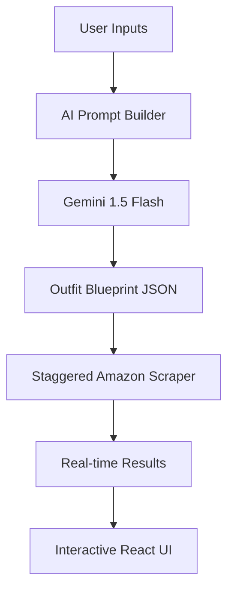

# 🧥 Budget-Based AI Outfit Recommendation System

<div align="center">
  <br />
  <p align="center">
    <b>An Advanced AI-Driven Stylist with Real-Time E-Commerce Integration.</b>
  </p>

  [](https://budget-based-ai-oufit-generator.netlify.app/)
  [](https://github.com/eshwarprudhvi)
</div>

---

## 🌟 Overview

This project is a sophisticated fashion styling platform that generates complete outfit recommendations based on a user's budget, occasion, and style preferences. It leverages **Google Gemini 1.5 Flash** for intelligent styling and a custom **High-Performance Scraper** to fetch live products from Amazon India.

---

## ✨ Key Features

- **🧠 Intelligent AI Styling**: Uses LLMs to understand complex style archetypes like *Chic*, *Boho*, and *Elegant*.
- **💰 Smart Budget Allocation**: Automatically distributes the total budget across items using a priority-weighted algorithm.
- **🔍 Real-time Scraping**: Custom Cheerio-based engine that fetches live product data (Price, Image, Links) from Amazon.
- **🎨 Personalized Filters**: Support for occasion-based styling, gender-specific results, and color palette preferences.
- **🔒 Secure Auth**: Full user authentication system with JWT-protected recommendation routes.
- **📱 Premium UI**: Responsive, glassmorphic design built with React 19 and Tailwind CSS 4.

---

## 🚀 Technical Excellence (Skill Showcase)

### 1. AI Prompt Engineering & Logic
The system doesn't just ask for an outfit; it uses a **Weighted Styling Engine**:
- **Proportional Budgeting**: Calculates exact price caps for each item before generating the search blueprint.
- **Contextual Styling**: Dynamically adjusts search queries based on the "vibe" (e.g., "Blazer" for Formal, "Hoodie" for Casual).

### 2. High-Performance Scraping Pipeline
To ensure speed and reliability, the backend implements:
- **Staggered Parallel Concurrency**: Uses `Promise.all` with staggered delays (300ms) to maximize throughput while avoiding bot detection.
- **Query Deduplication**: Efficiently handles multiple outfit requests by deduplicating search queries across the session.
- **In-Memory Caching**: Uses a `Map` structure to instantly link AI blueprints to scraped results.

---

## 🛠️ Tech Stack & Architecture



| Layer | Technologies |
| :--- | :--- |
| **Frontend** | React 19, Vite, Tailwind CSS 4, React Router 7 |
| **Backend** | Node.js, Express, MongoDB, Mongoose |
| **AI** | Google Generative AI (Gemini SDK) |
| **Scraping** | Axios, Cheerio |
| **Auth** | JWT, BcryptJS |

---


---

## 📦 How to Run Locally

### 1. Clone & Install
```bash
git clone https://github.com/eshwarprudhvi/budget-based-outfit-recommendation-system.git
cd budget-based-outfit-recommendation-system
```

### 2. Backend Setup
```bash
cd backend
npm install
# Add .env with GEMINI_API_KEY, MONGODB_URI, JWT_SECRET
npm run dev
```

### 3. Frontend Setup
```bash
cd ../frontend
npm install
npm run dev
```

---

## 📜 Future Enhancements
- [ ] Integration with Flipkart & Myntra APIs.
- [ ] AI-powered "Mix & Match" using user-uploaded photos.
- [ ] Real-time price drop notifications for saved outfits.

---

## 👤 Author: Prudhvi Eshwar
Passionate Full-Stack Developer specialized in AI-integrated web applications.

---
<p align="center">⭐ <b>If you like this project, give it a star!</b></p>
